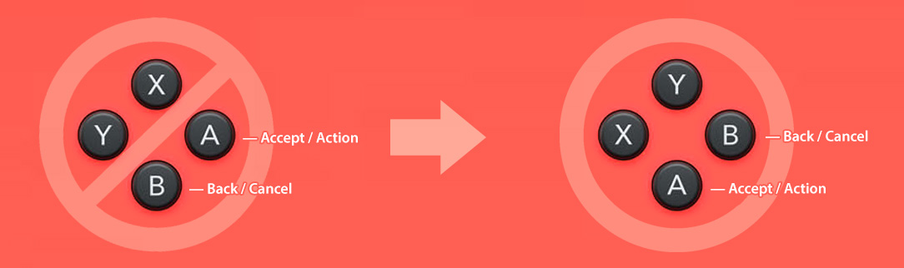
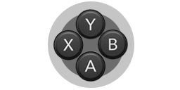

# ButtonSwap3DSx

Swap **Nintendo 3DS** buttons with the layout of Xbox and PlayStation controllers



The ABXY buttons aren't just labels. On Xbox and PlayStation consoles, the **Accept/Action** button is in the bottom position, and the button for **Back/Cancel** is to the right. Nintendo layout is the opposite. For those who prefer Xbox and PlayStation layout, this swaps A with B and X with Y as illustrated above. No other buttons affected. No permanent changes. Remains in effect until you restart.

# How to Use

Step Zero: [Download](https://github.com/diedummydie/ButtonSwap3DSx/releases/latest) the latest build and install ButtonSwap.cia on your [unlocked (cfw)](https://3ds.hacks.guide) **Nintendo 3DS** using a CIA manager like FBI. This only needs to be done once.

1. Launch the app
2. Press Home to return to the normal 3DS menu
3. Start a game

Works with all versions of 3DS and 2DS, old/new/XL/non-XL.

---

| | |
|-|-|
|[](https://github.com/diedummydie/ButtonSwap3DSx/releases/latest)|[Download](https://github.com/diedummydie/ButtonSwap3DSx/releases/latest)|


### About Mode3 Build

ButtonSwap-Mode3 is a special build for running ButtonSwap with extended memory games on old3DS. There is no need to install ButtonSwap-Mode3 on new3DS since the main edition works just fine.

### How to customize

ButtonSwap3DS(x) isn't configurable unless you know how to write assembly language for ARM processors. *(This project exists so that you don't have to write assembly and compile it yourself.)*

If you do with to customize, you will need GNU c-lang build tools (gcc and make). These are usually included with Linux distributions, but install the `build-essential` package if necessary. On macOS, run `xcode-select --install` to get command line build tools, or install XCode from the App Store. Windows may install these tools when using the devkitARM installer below. Otherwise Windows users should select `gcc-core` and `make` when installing [Cygwin](https://sourceware.org/cygwin/).

You will need a working setup of the [devkitARM](https://www.3dbrew.org/wiki/Setting_up_Development_Environment) toolchain for 3DS.

You will also need the [ScenicRoute](https://github.com/Stary2001/ScenicRoute) library by Stary2001. Clone it, then run make install in the ScenicRoute directory.

You may also need [bannertool](https://github.com/Steveice10/bannertool/releases) and [makerom](https://github.com/profi200/Project_CTR/releases), and either add them to your $PATH or install them somewhere already in your $PATH like /usr/local/bin.

Finally, clone this repository. If you would prefer to work with the upstream project, you may need to remove references to SeedDB in cia.rsf and cia_mode3.rsf as I did.

The instructions for each type of mapping are provided in source/injected.s. Micahjc also provided a Java app to generate the correct button masks and coordinate values. When you have saved your mappings into this file, you will need to compile it. To build, change to the ButtonSwap3DS directory in a terminal, then run make.

For example, this is the code for the ButtonSwap3DSx configuration which is included in this release.

```asm
@ swap A:B
ldr r4, =0x1
ldr r5, =0x2
bl .button
ldr r4, =0x2
ldr r5, =0x1
bl .button
@ swap X:Y
ldr r4, =0x400
ldr r5, =0x800
bl .button
ldr r4, =0x800
ldr r5, =0x400
bl .button
```

## Acknowledgements

44670 for memory patching code from [BootNTR](https://github.com/44670/BootNTR)

Shinyquagsire23 for his writeup on [redirecting input over WiFi](http://douevenknow.us/post/139673444953/redirecting-3ds-input-over-wifi)

Stary2001 & Kazo for [InputRedirection](https://github.com/Stary2001/InputRedirection)

Mikahjc for [ButtonSwap3DS](https://github.com/mikahjc/ButtonSwap3DS) from which this project was forked

